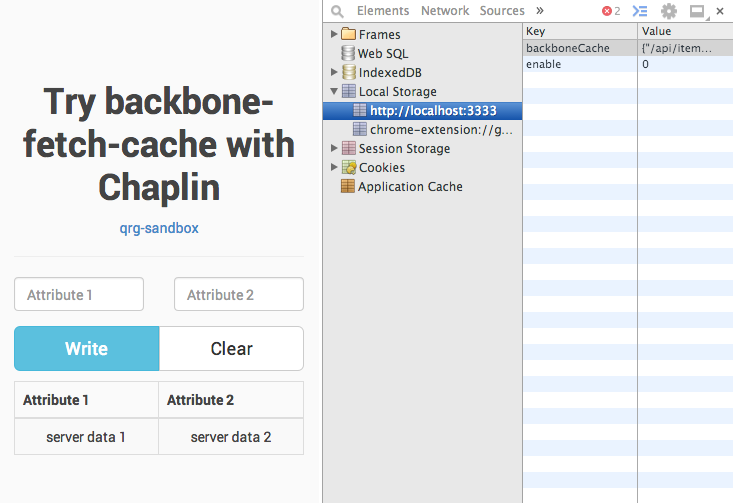

try backbone-fetch-cache
===============

Overview
---------------



Try [mrappleton/backbone-fetch-cache](https://github.com/mrappleton/backbone-fetch-cache) with Chaplin.

* CoffeeScript
* Jade
* Sass
* [Chaplin](http://chaplinjs.org/)
* [backbone-fetch-cache](https://github.com/mrappleton/backbone-fetch-cache)

Installation
---------------

``` sh
$ gem install sass
$ npm install -g brunch bower coffee-script
$ npm install && bower install
```

Try
---------------

``` sh
$ ulimit -n 10000
$ brunch watch --server
```

Open `http://localhost:3333`.
